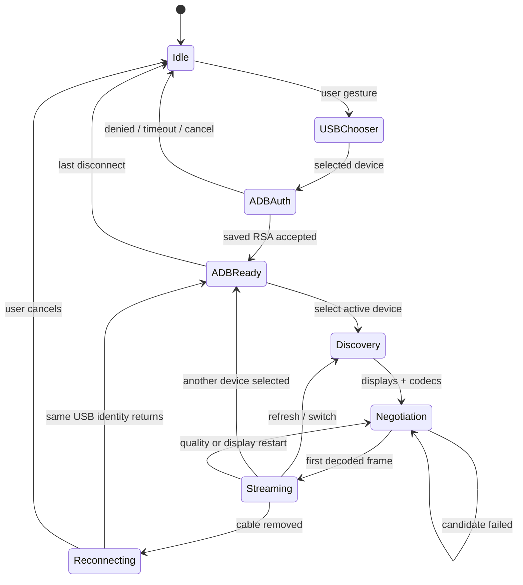

# Architecture and lifecycle

OpenDroid Remote is a single client-side application. The hosted and static
builds execute the same `src/App.tsx` and core modules; no application logic
runs on a remote service.

## Connection and active-session lifecycle



`WebUsbAdbTransport` owns a map of ADB connections keyed by stable device
serial. Each serial has its own in-flight Promise, cancellation token, timeout,
status, USB cleanup, and disconnection observer. Connecting or cancelling one
device cannot supersede or close another. `AdbAuthentication` owns the protocol
handshake and its two timeouts; USB enumeration and presentation do not
duplicate that logic.

The upstream WebUSB device observer updates the authorized-device inventory on
physical attach/remove events. A physical loss creates a reconnect intent for
that exact connected identity. When an authorized USB serial returns, its ADB
interface is opened asynchronously with the saved key and the active scrcpy
workspace resumes. It never claims a never-authorized interface: first use
still requires the browser chooser.

Authentication has separate observable handshake and approval phases. The
transport remains in `authenticating` while it tries retained signatures and
enters `authorizing` only when Android rejects those signatures and the client
actually sends its public key. A silent saved-key handshake therefore never
tells the user to wait for a nonexistent popup. If the pre-approval handshake
stops responding, the USB interface is reopened with the same credential ring
under a bounded retry policy; reconnect intents also schedule a later scan
instead of retaining a stale approval state.

USB serial descriptors are used directly when available. If WebUSB exposes
only the upstream vendor/product fallback, distinct `USBDevice` objects receive
collision-free provisional IDs; after authentication the transport probes the
standard Android serial properties and rekeys the connection when one is
available. Device names are presentation only. Every visible label includes
the identity key.

The UI currently owns one `ScrcpySession` and one video canvas. A single
`SerialTaskQueue` owns every mutation of that session: activation, fallback
selection, disconnect cleanup, reconnect resume, quality restart, capability
refresh, and dynamic-display restart. A rejected operation cannot poison later
work. Selecting an ADB-ready device releases all old input state and moves the
workspace to that connection; all other ADB connections remain alive and
independently disconnectable.

ADB authentication does not set a global UI lock. Pending devices publish
per-device `connecting`/`authenticating`/`authorizing` status and can be
cancelled while the active stream and settings remain usable.

`StableAdbCredentialStore` wraps the upstream credential store and migrates
every existing key into a dedicated OpenDroid key ring mirrored in IndexedDB
and localStorage. The primary identity is always presented first, retained
legacy keys are still tried by signature, and concurrent first-time
authentication serializes generation. A reconnect therefore cannot receive a
new browser identity merely because a cable or ADB socket was interrupted.

## scrcpy startup

1. Fetch the same-origin bundled server asset.
2. Calculate SHA-256 with Web Crypto and compare it to the compile-time pin.
3. Push the verified bytes over authenticated ADB.
4. Query displays and encoders with the same server protocol version while
   retaining the pushed server across both one-shot processes.
5. Run focused-display capability adapters and browser video/audio decoder
   probes.
6. Build ordered codec/encoder candidates.
7. Start a candidate with video, control, the validated raw/compressed
   output-audio choice, and metadata enabled. Audio failure is non-fatal on
   unsupported Android versions.
8. Construct the selected WebGL/bitmap renderer, a configured WebCodecs video
   decoder, and a bounded Web Audio sink.
9. Require a valid first decoded video size within ten seconds.
10. On failure, close client/decoder/audio/timers, invalidate the cleaned server
    deployment, re-push it, and continue to the next candidate.

The active decoder size is the control protocol size source. Size-change events
update rendering, profile orientation, and coordinate conversion immediately.
Every asynchronous video callback also verifies that its originating scrcpy
client is still active. A late failure from a stopped client cannot overwrite a
replacement session, and a stream that ends before its first frame rejects the
current startup attempt immediately instead of waiting for the frame timeout.

## Audio lifecycle

The default stream requests scrcpy’s `output` audio source with raw, interleaved
48 kHz signed 16-bit stereo PCM. Upstream scrcpy redirects that output to the
host, so device-local playback is off by default. Runtime-probed Opus, AAC, and
FLAC choices pass encoded packets through WebCodecs `AudioDecoder`. An explicit
Android 13+ profile-independent stream option changes the source to `playback`
and enables `audioDup`.

ADB authentication intentionally leaves ya-webadb’s `readTimeLimit` unset.
That option is a debugging assertion for an unread logical socket, not a
physical USB liveness check. Enforcing it on long-lived scrcpy media/control
sockets can turn temporary browser backpressure into a false whole-device
disconnect.

`PcmAudioPlayer` converts raw or decoded frames to Web Audio buffers, carries
partial PCM frames across scrcpy packets, and schedules the configured short
interactive queue. If browser throttling grows that queue past its guarded
target, queued buffers are dropped instead of allowing control/audio latency
to accumulate. Browser autoplay blocking is represented as a recoverable
state; the media stream is still consumed and the user can resume playback
with a button gesture.

## Input ownership

Direct browser contacts and game mappings use disjoint pointer-ID ranges.
`TouchRegistry` owns every synthetic pointer until its UP/CANCEL has been
written. Each mapping ID is an owner, so a joystick, fire button, held key, and
mouse-look can remain down simultaneously without overwriting one another.

The control adapter serializes all control writes on a Promise chain. A failed
write is logged and does not corrupt the ordering of subsequent cleanup writes.
Its direct mouse path is separate from touch injection:

- Physical mode probes whether the ADB shell can open `/dev/uhid`, then
  registers the upstream scrcpy five-button relative HID mouse descriptor.
  Browser movement, button state, and both wheel axes become kernel UHID input
  reports, so Android discovers the same class of device as a wired mouse.
- The probe runs before scrcpy starts because a rejected `UHID_CREATE` can end
  scrcpy’s controller thread. If creation still loses a capability race, the
  candidate is cleaned up and retried in a fresh process with direct mouse
  disabled.
- SDK compatibility is an explicit user choice. It uses scrcpy’s absolute
  mouse pointer ID and hover/button/scroll messages. Its held-button registry
  supplies authoritative button masks and emits every outstanding UP on blur,
  mode change, or shutdown. It is never selected silently because some Android
  versions treat a primary SDK click as touch-compatible.
- Touchscreen tap mode maps desktop mouse clicks and drags directly to scrcpy
  touch pointer events without sending any hover movement. This provides a pure
  touch experience with zero hover pointers on Android.
- Touchscreen/pen contacts and game mappings keep using independent scrcpy
  touch pointer IDs. A desktop mouse does not enter that path in physical mode.

There are only two mapping modes. Edit exposes overlay handles and pauses
direct device input. Play routes mapped keys to the mapping engine, passes
every supported unmapped key to Android, and leaves direct
mouse/touch/scroll available unless an enabled mapping for the current
orientation explicitly captures that button.

The video element installs its wheel handler directly with `{ passive: false }`.
While Play/direct control is active it prevents browser scrolling before
routing normalized pixel/line/page deltas to the selected Android mouse path.
In Edit, wheel input is left to normal page scrolling. React pointer handlers
route desktop mouse buttons to UHID/SDK control and reserve scrcpy touch
DOWN/MOVE/UP for direct touch contacts and explicit mapping actions.

Pointer Lock supplies continuous relative movement for the UHID mouse and for
an explicitly configured touch mouse-look mapping. The browser first requests
unadjusted movement and retries standard Pointer Lock when raw movement is not
available. Esc exits capture and releases every held physical and synthetic
button/contact. UHID has no virtual screen boundary. Touch mouse-look must use
absolute Android contacts, so it ends at its aspect-correct radius, restarts at
the configured center, and consumes the remaining delta. Per-mapping Promise
queues keep rapidly arriving deltas ordered.

Synthetic state is released on:

- key/button release
- completed timed action
- emergency key
- entry into Edit mode
- Pointer Lock exit for mouse-look
- profile or orientation change
- window blur or page visibility loss
- stream restart, disconnect, or unmount

`DirectKeyRegistry` separately owns every keyboard key injected into Android.
Key-up uses the same Android key code and meta state captured at key-down, even
if focus or the active mapping profile changed meanwhile. Lifecycle cleanup
drains that registry before closing or replacing the control channel.

The application retains one `MappingEngine` across edits to the active profile.
Profile, orientation, and enabled-state changes are coalesced on a serialized
configuration queue. The old input generation is fully released before the new
context becomes visible; an existing browser Pointer Lock session is re-armed
against the new mouse-look mapping. Generation guards prevent an in-flight
repeat or swipe callback from recreating a touch after cleanup.

## Coordinate model

Profiles store normalized coordinates. A padding-free viewport calculates the
video surface size from the live aspect ratio. Event-time hit-testing derives
the exact contained video rectangle again, so a fractional CSS rounding or
independently constrained outer box cannot introduce center-outward drift.
Browser client coordinates are divided by that visible rectangle, clamped only
for active drags, and multiplied by `width - 1` / `height - 1` for scrcpy.

Joystick and mouse-look radii are based on the shorter physical video edge:

```text
radiusX = normalizedRadius × min(videoWidth, videoHeight) / videoWidth
radiusY = normalizedRadius × min(videoWidth, videoHeight) / videoHeight
```

This makes a radial mapping remain circular rather than becoming an ellipse on
ultrawide or portrait displays.

## Capability policy

The system follows capability evidence, not device identity:

- browser APIs are tested directly
- codecs use `VideoDecoder.isConfigSupported`
- displays and encoders come from scrcpy
- focus adapters use successful standard shell output
- physical mouse support comes from an actual `/dev/uhid` open/close probe
- WebGL construction failure selects bitmap rendering
- an absent/ambiguous focused display omits the server option instead of
  guessing an ID

New compatibility logic belongs in a documented adapter with a capability
probe and unit tests.

## Persistence and privacy

Profiles use an IndexedDB object store keyed by `id`; localStorage is a
best-effort fallback. A strict runtime validator gates save, import, and export.
`ProfileImporter` owns ordered multi-file validation and collision behavior;
IDs created by an imported copy receive fresh timestamps and mapping IDs, and
duplicate IDs inside one batch obey the same rule as existing stored profiles.
Versioned application settings in localStorage contain validated defaults,
per-serial stream overrides, reconnect behavior, and profile-import behavior.
The ADB key ring has its own IndexedDB database and localStorage mirror.
Diagnostics are a bounded in-memory list with Error and BigInt sanitization.

The only application fetch is the same-origin bundled scrcpy server. Upstream
source links in the Debug / Capabilities sidebar panel are ordinary user-activated links.
